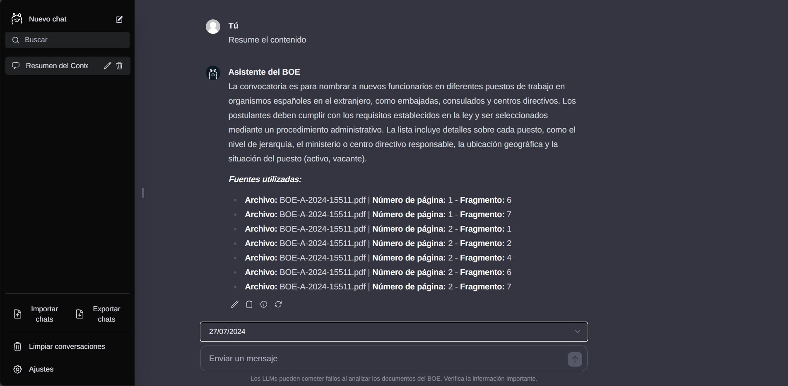

# BOE Knowledge Assistant

> [!NOTE]
> Para leer este documento en español, visita este [archivo](README-es.md)

This project provides a system to interact with the *Boletín Oficial del Estado* (BOE) by allowing users to query, process, and manage documents based on selected publication dates. 

The system utilizes Large Language Models (LLMs) to process BOE documents and perform advanced text analysis. In addition, it implements an embedding-based search architecture to identify and extract relevant context accurately. This enables users to execute highly specific semantic searches and retrieve relevant results efficiently. The ultimate goal is to provide a robust, user-friendly tool to access and manage BOE-related information.

## Table of Contents
- [1. Key Features](#1-key-features)
- [2. Project Architecture](#2-project-architecture)
- [3. Nginx Reverse Proxy Configuration](#3-nginx-reverse-proxy-configuration)
- [4. Dependencies and Frameworks](#4-dependencies-and-frameworks)
- [5. Web Interface](#5-web-interface)

## 1. Key Features
The system offers a wide range of functionalities designed to facilitate the efficient retrieval and management of BOE documents:

- **BOE Download by Date**: Enables users to search for and download BOE documents by specifying individual dates or date ranges, ensuring rapid access to the required information.
- **Local Document Import**: Users can upload local documents for the system to process, offering flexibility when managing external or custom document sets.

  
  

- **Parameter Configuration**: Through an intuitive web interface, users can adjust processing parameters such as `CHUNK_SIZE` and `CHUNK_OVERLAP` to optimize document ingestion according to specific capabilities or hardware constraints.
- **Customizable Graphical Interface**: Includes support for both dark and light modes, allowing users to adapt the visual interface to their preferences.
- **Secure Data Deletion**: Users may request the complete and secure deletion of the underlying database and stored documents directly from the interface, complying with strict privacy and security standards.

    

- **Advanced Document Queries**: Supports advanced semantic queries concerning the downloaded documents' publication dates, providing quick and effective information retrieval.
- **Conversation Management**:
    - **Automated Title Generation**: Chats are automatically categorized by topic, improving tracking and readability.
    - **Conversation Deletion**: Allows users to delete all conversation history directly from the user interface, maintaining full control over stored data.
    - **Import/Export**: Facilitates importing and exporting conversations in JSON format for easy backups and integration with external tools.
- **Monitoring and Error Management**: The system relays clear state execution and operational errors to ensure the user is always informed about system health and execution status.

## 2. Project Architecture
The project is structurally organized into three distinct deployment strategies, which are maintained across separate GitHub branches to preserve clean architectural configurations:

- **`main`**: Utilizes a standard client-server architecture without Docker. A central Python server handles all client requests directly.
- **`docker-clientserver`**: Implements the standard client-server architecture containerized within Docker environments.
- **`docker-microservices`**: Utilizes a decentralized microservices architecture managed through Docker, isolating individual concerns to maximize system scalability and fault tolerance.

## 3. Nginx Reverse Proxy Configuration
This repository leverages Docker Compose to orchestrate the microservices environment, employing Nginx as a reverse proxy to route incoming traffic efficiently to the respective backend services. 

### Nginx Setup
Nginx is deployed as an isolated container within Docker Compose. Routing rules are defined in `nginx.conf`. The host's port `3001` is mapped to the Nginx container's port `80`. Nginx then resolves incoming requests based on the following pattern:

- Requests routed to `localhost:3001/chat` are redirected to the microservice running on port `5001`.
- Requests routed to `localhost:3001/dates` are redirected to the respective microservice running on port `5007`.

All deployment services are connected to a shared internal `app-network` via Docker Compose, facilitating secure and cohesive internal communications.

## 4. Dependencies and Frameworks
This project integrates multiple technologies to guarantee optimal performance and scalability:

### Frameworks and Runtime
- **Ollama**: utilized for the orchestration and local execution of LLM models. It serves as the primary inference engine required for BOE document processing.
- **Node.js 18**: The primary runtime environment for constructing the frontend interface, offering solid performance and modern JavaScript features.

### Modeling and Text Processing Tools
- **Llama 3.1 (8B Instruct q5_K_M)**: Serves as the core inference model for text summarization, analysis, and data extraction from BOE documents. It was chosen to balance structural data handling performance and computational limits.
- **joanfm/jina-embeddings-v2-base-es**: An embedding model heavily optimized for the Spanish language. It computes the vector representations of BOE texts, vastly increasing search precision and retrieval accuracy.

### Python Dependencies
Prior to running standalone server scripts, all explicit Python dependencies must be installed. These are strictly versioned within the base `requirements.txt` file to maintain replicability across execution environments.

## 5. Web Interface
The system features a web interface derived from *Ollama Web UI Lite*, engineered into a modular environment configured strictly for the application's unique requirements:

- **TypeScript Migration**: Enforces strong typing to improve code maintainability, minimize runtime errors, and simplify developer collaboration.
- **Modular Architecture**: Organizes component logic to scale cleanly when implementing custom capabilities or adding system adjustments.
- **Automated Testing Suite**: Implements exhaustive tests to ensure module stability and a consistent application behavior under load.
