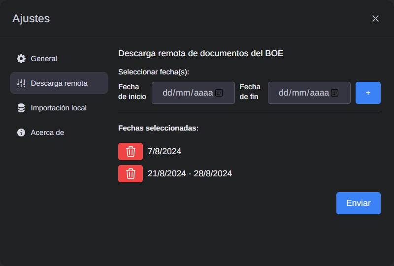
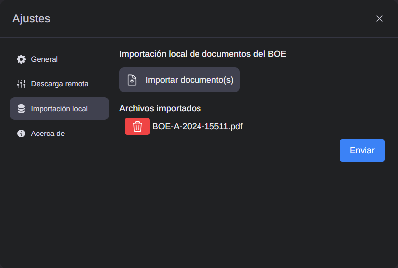
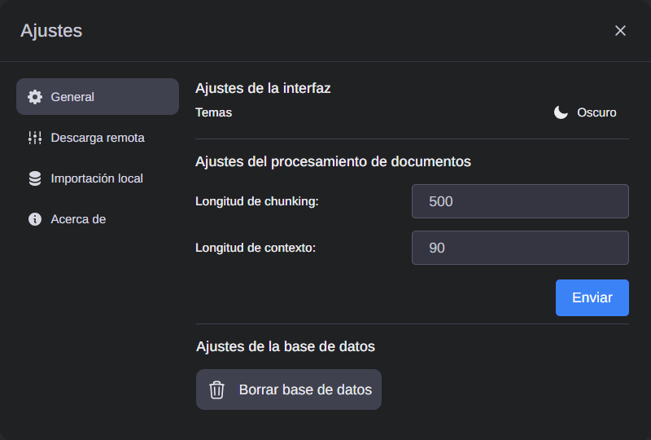

# Programa de consulta y gestión de documentos del BOE mediante LLM
Este proyecto está diseñado para permitir a los usuarios interactuar con el Boletín Oficial del Estado (BOE) mediante la consulta y gestión de documentos utilizando fechas seleccionadas por ellos.

El sistema utiliza el lenguaje de modelado de lenguaje (LLM) para procesar los documentos del BOE y realizar análisis de texto. Además, se busca implementar un algoritmo basado en embeddings para identificar y extraer información relevante de los documentos. Esto permitirá a los usuarios realizar búsquedas más precisas y obtener resultados más relevantes. El objetivo final es proporcionar una herramienta eficiente y fácil de usar para acceder y gestionar la información del BOE de manera efectiva.

## Características principales
El sistema ofrece una variedad de funcionalidades diseñadas para facilitar la consulta y gestión eficiente de documentos del BOE (Boletín Oficial del Estado):

- **Descarga de BOE por fecha**: Permite buscar y descargar documentos del BOE especificando fechas individuales o rangos de fechas, asegurando acceso rápido a la información necesaria.
- **Importación de documentos locales**: Los usuarios pueden cargar documentos locales para que el sistema los procese, garantizando flexibilidad en la gestión de documentos propios o externos.
    

**Configuración de parámetros**: A través de una interfaz web intuitiva, los usuarios pueden ajustar parámetros como `CHUNK_SIZE` y `CHUNK_OVERLAP` para optimizar el procesamiento eficiente de documentos según sus necesidades específicas.
- **Interfaz gráfica personalizable**: Se ofrece la opción de seleccionar entre temas de colores oscuros o claros, permitiendo a los usuarios adaptar la interfaz visual a sus preferencias individuales.
- **Eliminación segura de datos**: Desde la interfaz del sistema, los usuarios pueden solicitar la eliminación completa y segura de la base de datos y los documentos almacenados, cumpliendo con estándares de seguridad y privacidad.

 
- **Consultas avanzadas sobre documentos**: Facilita la realización de consultas avanzadas basadas en las fechas de publicación de los documentos descargados, proporcionando un acceso rápido y efectivo a la información relevante.
- **Gestión de conversaciones**
    - Generación automática de títulos de conversación: Las conversaciones se organizan por temas, mejorando la comprensión y seguimiento de los intercambios.
    - Borrado de conversaciones: Permite a los usuarios eliminar todas las conversaciones mantenidas con el sistema directamente desde la interfaz, proporcionando control total sobre los datos almacenados.
    - Importación y exportación de conversaciones: Facilita la importación y exportación de conversaciones en formato JSON, permitiendo una integración fluida con otras plataformas y herramientas.

- **Monitoreo y gestión de errores**: El sistema informa claramente sobre cualquier error o estado de operación, garantizando que los usuarios estén siempre informados sobre el funcionamiento del sistema y puedan tomar medidas adecuadas si es necesario.

Estas características combinadas hacen que el sistema sea robusto y versátil, adecuado tanto para usuarios individuales como para entornos empresariales que requieran una gestión eficiente de documentos y comunicaciones.

## Arquitectura del proyecto
El proyecto se organiza en tres formas distintas cada una de ellas implementadas en distintas ramas de GitHub siguiendo cada una con su propia configuración arquitectónica:

- main: Utiliza una arquitectura cliente-servidor básica sin Docker donde un servidor central gestiona todas las peticiones de los clientes.
- docker-clientserver: Implementa con una arquitectura cliente-servidor básica para ello se utiliza Docker.
- docker-microservices: Utiliza Docker con una arquitectura de microservicios descentralizada, donde cada servicio es independiente, promoviendo la escalabilidad y la robustez del sistema.

## Uso de Nginx como Proxy en Docker Compose
Este repositorio utiliza Docker Compose para gestionar un entorno de microservicios, donde Nginx desempeña un papel crucial como servidor proxy para dirigir las solicitudes entrantes a diferentes servicios del backend. A continuación se detalla cómo se configura Nginx y su integración con los microservicios.

### Configuración de Nginx
Nginx se configura como un contenedor separado en Docker Compose. La configuración se realiza mediante el archivo nginx.conf, el cual define las reglas de proxy para redirigir las peticiones a los microservicios específicos. Para ello se mapea el puerto 3001 del host al puerto 80 del contenedor Nginx para gestionar las solicitudes entrantes. Por ejemplo, Nginx redirige las peticiones entrantes según las siguientes reglas:

- Las solicitudes a localhost:3001/chat se redirigen al microservicio en el puerto 5001.
- Las solicitudes a localhost:3001/dates se redirigen al microservicio correspondiente en el puerto 5007.

Todos los servicios están conectados a la red app-network en Docker Compose para facilitar la comunicación interna y asegurar un entorno cohesivo para la aplicación.

## Dependencias y frameworks
El proyecto utiliza una combinación de tecnologías y frameworks para asegurar su funcionamiento efectivo y eficiente:

### Frameworks y Entornos de Ejecución
- Olla Framework: Este framework proporciona la estructura y funcionalidades fundamentales del sistema, facilitando la gestión de modelos y la integración de servicios necesarios para el procesamiento de documentos del BOE.
- Node.js 18: Se emplea como el entorno de ejecución principal para construir y operar la aplicación. Node.js ofrece un soporte moderno y eficiente para JavaScript, lo que es crucial para mantener la escalabilidad y el rendimiento del sistema.

### Modelos y Herramientas de Procesamiento de Texto
- Llama3.1:8b-instruct-q5_K_M: Este modelo desempeña un papel central en la extracción de información y análisis de documentos del Boletín Oficial del Estado (BOE). Es esencial para manejar tanto datos estructurados como no estructurados, mejorando significativamente la capacidad del sistema para proporcionar resultados precisos y relevantes.
- joanfm/jina-embeddings-v2-base-es: Diseñado específicamente para el procesamiento de textos en español, este modelo de embeddings optimiza la precisión de las consultas realizadas sobre los documentos del BOE. Al integrarse con el sistema, fortalece la capacidad de búsqueda y análisis del proyecto.

### Dependencias de Python
Antes de ejecutar cualquier script del servidor, es necesario instalar las siguientes dependencias específicas de Python. Estas están detalladas y especificadas en el archivo requirements.txt, asegurando que el entorno de ejecución del servidor esté completamente configurado y funcional.

## Interfaz web
La interfaz web utilizada en este proyecto se basa en Ollama Web UI Lite, una versión optimizada y modular de la interfaz de usuario que se adapta a los requisitos necesarios para poder realizar las funciones descritas anteriormente. Esta versión presenta las siguientes características destacadas:

- Migración a TypeScript: Mejora la robustez y mantenibilidad del código, reduciendo errores y facilitando la colaboración entre desarrolladores.
- Arquitectura modular: Permite una organización más clara y escalabilidad fácilmente gestionable, facilitando la adición y modificación de funcionalidades.
- Pruebas exhaustivas: Implementación de pruebas completas para garantizar la estabilidad y fiabilidad del sistema, asegurando un comportamiento predecible y consistente.

